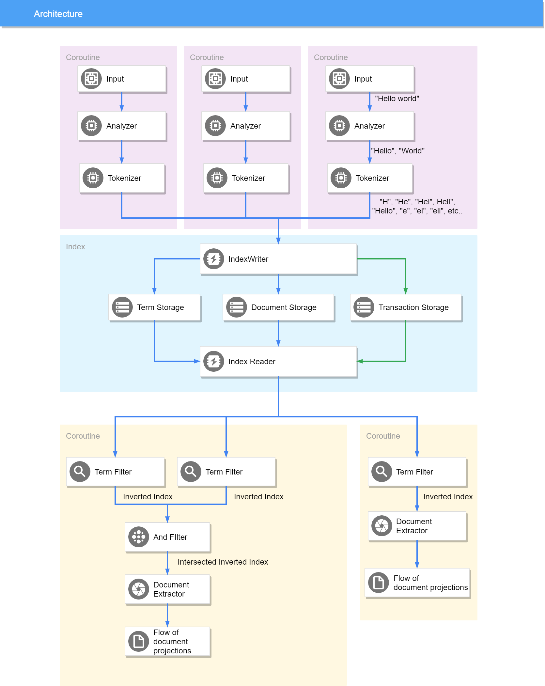

# Simple fulltext indexer

This repo contains simple fulltext indexer, which supports following operations :
1. Indexing source input, analyze and tokenize it
1. Parallel writes and reads
1. Atomic writes and reads, read committed isolation
1. Transactional commits and rollbacks across multiple documents
1. Different filters, for example by term, AND filter, etc
1. Document projections


# Architecture 




# Usage

All the usage examples located in an integration test, RAMIndexIt

## Simple indexing 

```kotlin
// create ram index
val index = RAMIndex()
// create writer
val writer = AtomicIndexWriter(index)

// index files with info about cattles
val cattleIndexing = GlobalScope.launch {
    writer.inTransaction {
        index(
            CompositeTermSource(
                Source("file", "cattle.txt"),
                // file source
                FileInput(getPathForResource("cattle.txt"), 1024),
                // analyzer which split input by space
                WhiteSpaceAnalyzer(),
                // tokenizer which do not modify source input
                NOOPTokenizer()
            )
        )
    }
}

// index files with information about dogs
val dogIndexing = GlobalScope.launch {
    writer.inTransaction {
        index(
            CompositeTermSource(
                Source("file", "dog.txt"),
                // file source
                FileInput(getPathForResource("dog.txt"), 1024),
                // analyzer which split input by space
                WhiteSpaceAnalyzer(),
                // tokenizer which do not modify source input
                NOOPTokenizer()
            )
        )
    }
}

// wait indexing to finish
cattleIndexing.join()
dogIndexing.join()

val reader = AtomicIndexReader(index)

reader
    .search(
        // search for all the documents which contains control term
        TermFilter("control"),
        // extract positions of control term from document
        DefaultDocumentExtractor(listOf("control"))
    )
    .collect {
        // input such information 
        print("Term 'control' was found in a document ${it.document.source.name} at positions :")
        for (pos in it.terms["control"]?.iterator()!!) {
            print("${pos} ")
        }
        println()
    }
```

## Atomic indexing example 

```kotlin
val index = RAMIndex()
val writer = AtomicIndexWriter(index)

val firstIndexingLock = Mutex(true)
val secondIndexingLock = Mutex(true)

val latch = CountDownLatch(2)

// start indexing, but do not commit it
val firstJob = GlobalScope.launch {
    writer.inTransaction {
        index(Dataset.GOAT.getTermSource())
        index(Dataset.CAT.getTermSource())
        // index data, but don't commit it
        latch.countDown()
        firstIndexingLock.withLock { }
    }
}

val secondJob = GlobalScope.launch {
    writer.inTransaction {
        // index documents in transaction. All the documents added or none
        index(Dataset.CATTLE.getTermSource())
        index(Dataset.SHEEP.getTermSource())
        // index data, but don't commit it
        latch.countDown()
        secondIndexingLock.withLock { }
    }
}

latch.await()
// nothing is committed yet, we won't see anything 
searchForTermListAndValidate(AtomicIndexReader(index), listOf("milk"), emptySet())

// commit first indexing, we should see milk keyword inside GOAT dataset
firstIndexingLock.unlock()
firstJob.join()
searchForTermListAndValidate(AtomicIndexReader(index), listOf("milk"), setOf(Dataset.GOAT))

// commit second indexing, now we should see milk keyword inside goat, cattle and sheep documents
secondIndexingLock.unlock()
secondJob.join()
searchForTermListAndValidate(
    AtomicIndexReader(index),
    listOf("milk"),
    setOf(Dataset.GOAT, Dataset.CATTLE, Dataset.SHEEP)
)
```


# Indexing cancellation

```kotlin

val index = RAMIndex()
val writer = AtomicIndexWriter(index)

val firstIndexingLock = Mutex(true)
val secondIndexingLock = Mutex(true)

val latch = CountDownLatch(2)

val firstJob = GlobalScope.launch {
    writer.inTransaction {
        index(Dataset.GOAT.getTermSource())
        index(Dataset.CAT.getTermSource())
        // index data, but don't commit it
        latch.countDown()
        firstIndexingLock.withLock { }
    }
}

val secondJob = GlobalScope.launch {
    writer.inTransaction {
        index(Dataset.CATTLE.getTermSource())
        index(Dataset.SHEEP.getTermSource())
        // index data, but don't commit it
        latch.countDown()
        secondIndexingLock.withLock { }
    }
}

latch.await()
// nothing is committed yet, we won't see any data
searchForTermListAndValidate(AtomicIndexReader(index), listOf("milk"), emptySet())

// commit first transaction, now we'll see GOAT dataset
firstIndexingLock.unlock()
firstJob.join()
searchForTermListAndValidate(AtomicIndexReader(index), listOf("milk"), setOf(Dataset.GOAT))

// cancel second transaction. We won't see any differences and all updates during second transaction
// indexing will be reverted
secondJob.cancel()
secondJob.join()
secondIndexingLock.unlock()
searchForTermListAndValidate(AtomicIndexReader(index), listOf("milk"), setOf(Dataset.GOAT))

```